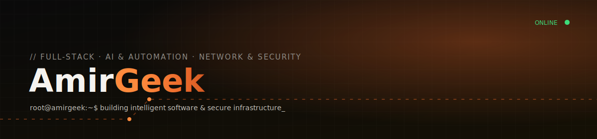

 

  

 

## About Me

I'm **Amir Mohammad Mohammadi**, known online as **AmirGeek** — a software engineer who builds complete systems rather than isolated apps. My work sits at the intersection of **full-stack development**, **AI-driven automation**, and **Linux / network infrastructure**: designing the product, writing the backend, hardening the server it runs on, and automating the repetitive parts in between.

- 🔭 Currently building web platforms, Telegram bot ecosystems, and AI automation workflows at **Ziba Tarh Faraz**
- 🛡️ Previously handled network & security engineering at **Niro Motor**
- 🌱 Always deepening my AI/automation and infrastructure-security skillset
- 🎬 Sharing technical content for the Persian-speaking dev community on YouTube
- 💬 Ask me about Linux servers, Telegram bots, Python/Go backends, or Docker/Kubernetes
- ⚡ Fun fact: this profile README, my portfolio site, and my resume page are all one connected system — see the links below

 

## 🧰 Tech Stack

**Languages**
 

**Backend & Frontend**
 

**Infrastructure & DevOps**
 

**Databases & Cloud**
 

 

## 📊 GitHub Stats

 

 

## 🐍 Contribution Snake

  

> Generated automatically every day by the GitHub Action in `.github/workflows/snake.yml` — see the setup note below.

 

## 🌐 Find Me / Support This Work

 

 

 

Built with ❤️ and a lot of coffee · <a href="https://AmirGeekTech.online">AmirGeekTech.online</a>

# AmirGeekTech
